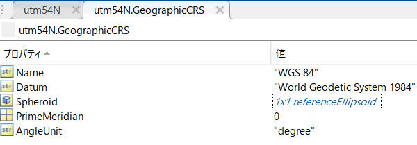

# iPhone LiDARで取得した3次元点群を地図上にプロットしてみよう

この記事は、MATLABアドベントカレンダー3日目の記事として書かれています。

[https://qiita.com/advent-calendar/2022/matlab](https://qiita.com/advent-calendar/2022/matlab)

  

この記事では、iPhone LiDARで取得した3次元点群をMATLABにて読み込み、さらに、地図（地球）上で可視化する方法について紹介します。言語はMATLABを使用します。

3次元点群を取得するためのアプリはScaniverseを用いました。

[https://scaniverse.com/](https://scaniverse.com/)

  

詳しい使い方は、以下の記事がわかりやすかったです。ここでは、すでにiPad LiDARにて計測し、PCに転送した状態から始めます。

[https://note.com/iwamah1/n/nc8a5427157ef](https://note.com/iwamah1/n/nc8a5427157ef)

なお、3次元モデルをエキスポートする際は、一番下のLAS形式を選択してください。


なお、ここで用いたコードや、点群ファイルは以下のページにアップロードされています。ぜひ、ダウンロードしてお使いください。

[https://github.com/KentaItakura/Plot-iPhone-LiDAR-data-in-3D-basemap-using-MATLAB](https://github.com/KentaItakura/Plot-iPhone-LiDAR-data-in-3D-basemap-using-MATLAB)

# 点群ファイルの読み込み

LiDAR toolboxの機能を用いて、点群データの読み込みを行います。以下のように、`lasFileReader`や`readPointCloud`関数を用いて、簡単に点群ファイルを読み込むことができます。

```matlab:Code
clear;clc;close all
% las/lazファイルを読み込むためのlasFileReader objectを作成する
lasReader = lasFileReader('treeTrunk.laz');
% las/lazファイルの、xyzおよび色情報を読み込み
ptCloud = readPointCloud(lasReader);
% 可視化
figure('Visible','on');pcshow(ptCloud)
```


以下のように、複雑な3次元形状を有する、樹木の幹部分をきれいに点群化できていることがわかります。

# 座標系の変換
## projcrsオブジェクトの作成

2022年12月においては、Scaniverseで、点群を取得し、エキスポートする場合（LAS形式）、経度・緯度ではなく、2次元平面に投影した方式でxy座標が保存されます。

具体的には、点群の座標は、東京で取得された場合、UTM N54（EPSGコード：32654）でエキスポートされます。後で用いる、`geoplot`関数との兼ね合いのため、これを経度・緯度に変換します。

`projcrs`関数に、EPSGコードを入力します。その結果、`projcrs`オブジェクトを作成することができます。

```matlab:Code
% projcrsオブジェクトを作成する
utm54N = projcrs(32654);
% 確認のため、CRSを表示
utm54N.GeographicCRS.Name
```

```text:Output
ans = "WGS 84"
```

UTMは、ユニバーサル横メルカトル（Universal Transverse Mercator）の略です。地球はおおよそ球形で、地球上の対象の座標は、3次元的に表すことができますが、それを2次元平面の投影しています。UTMはその投影方法の1つです。詳しい内容については、以下のページをご参照ください。

[https://www.gsi.go.jp/chubu/minichishiki10.html](https://www.gsi.go.jp/chubu/minichishiki10.html)

`projcrs`オブジェクトの中身は以下のようになっています。Nameには、投影方法が書いています。`lengthUnit`では、単位（メートル）が、`ProjectionMethod`には、投影方法が書いています。


さらに、ここの、`GeographicCRS`は、`geocrs`オブジェクトが格納されており、その中身は以下のようになっています。

WGS 84についてですが、地球はおおよそ球体をしており、それを数式などを使ってモデル化することで、測量を行うことができます。そのモデル化の方式には、日本測地系や世界測地系といった様々なものがあります。WGS 84は世界測地系の中の1つの方式です。

この説明については、以下のページがわかりやすかったです。

[https://club.informatix.co.jp/?p=642](https://club.informatix.co.jp/?p=642)

  


## 経度・緯度への変換

ここまで、iPhone LiDARの結果の表現に用いられた投影方法を表すオブジェクトを作成していました。次は、`projinv`関数を用いて、utm54Nのxy座標を経度・緯度に変換します。経度・緯度に変換することで、簡単に地図上にiPhone LiDARの点群の情報をプロットすることができます。

そして、この結果の可視化は、`geoplot`関数で行うことができます。

```matlab:Code
[lat,lon] = projinv(utm54N,ptCloud.Location(:,1),ptCloud.Location(:,2));
figure; geoplot(lat,lon)
% hold on;geobasemap('streets')
hold on;geobasemap('topographic')
```


上のようなプロットができましたが、これではどういう情報がプロットされているのかよくわかりません。もう少しズームアウトしてみます。

地図の上に、さきほどの樹木の幹の点群がプロットされていることがわかります。位置に関しても、この点群が取得された、東京都の代々木公園に正しくプロットされています。

ベースマップ（地図の種類）を変更するために、以下のように、geobasemapの中身を他のベースマップの種類を指定することもできます。

`geobasemap('topographic')`



さきほどの初めの図は少しわかりにくかったですが、樹木の点群を上から見た時のプロットを示しています。


  
# 3次元マップでの点群の可視化

さきほどは、地図上にて、点群を可視化しましたが、2次元のマップであったため、各点の位置やその上からの様子を知るということに限定されていました。これでは、iPhone LiDARで取得した3次元情報をうまく可視化できているとは言えません。このセクションでは、iPhone LiDARで取得した点群を、3次元のマップ上で可視化してみます。

```matlab:Code
% 25点のうち1点のみを表示する。重くなってしまうため。
mskip = 1:25:length(lat);
% 3Dで可視化するための図を用意する
uif = uifigure;
g = geoglobe(uif);
% プロット
geoplot3(g,lat,lon,ptCloud.Location(:,3)-mean(ptCloud.Location(:,3)),'r','MarkerSize',2,'Marker','o','HeightReference','terrain','LineStyle','none','MarkerIndices',mskip)
```

可視化している様子は以下の動画をご覧ください。

[https://www.youtube.com/watch?v=2nZdqEc1P7A](https://www.youtube.com/watch?v=2nZdqEc1P7A)

  

このように、3Dの地図（ベースマップ）上で、iPhone LiDARの点群を可視化することができました。

色はうまく表示できていませんが、ベースマップ上でどのような点群が取得されたかを確認することができます。

いくつか注意点があるので記述します。

   -  `r:` プロットの色。各点を実際の3Dの色付けを行うことができない。指定した1つの色のみの可視化になる 
   -  `'LineStyle','none'`: これにより、独立した点（線でない）をプロットできる 
   -  `'HeightReference','terrain'`: 高さの基準を設定する。このほかに、`'geoid'` や`'ellipsoid'`が選択可能である。それぞれの違いについては、以下の図を参照して下さい。 
   -  `'MarkerIndices'`にて間引きを行わないと、表示が非常の重くなるため注意する必要がある。 


**図表出展: 国土地理院 ジオイドとは**

https://www.gsi.go.jp/buturisokuchi/grageo_geoid.html

# まとめ

   -  この記事では、iPhone LiDARで取得した点群をMATLABを用いて、地図上で可視化しました 
   -  投影座標系から経度・緯度への変換も簡単に行うことができました 
   -  3Dのベースマップ上で、点群を可視化することができました 
   -  表示する点数が多くなると、非常にビューワーが重くなるため、間引くことが必要です 
   -  容量の大きな点群や色付きの点群を閲覧することが難しいという課題はありますが、3次元データをスマホで取得し、お手軽にMATLABで遊べるという点が非常によかったです 

# 参考にしたページ（本文中に記載がないもの）

[https://jp.mathworks.com/help/map/transform-coordinates-to-different-pcrs.html](https://jp.mathworks.com/help/map/transform-coordinates-to-different-pcrs.html)
